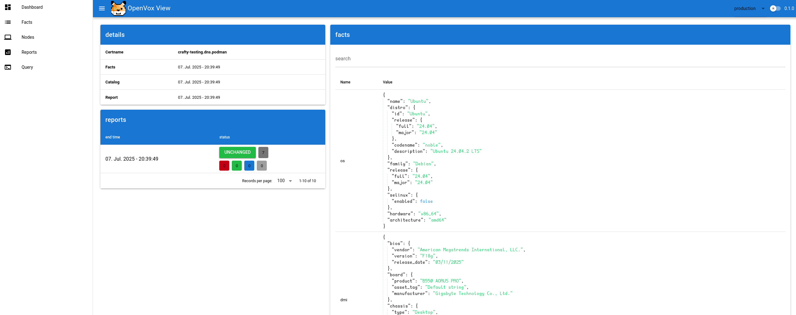
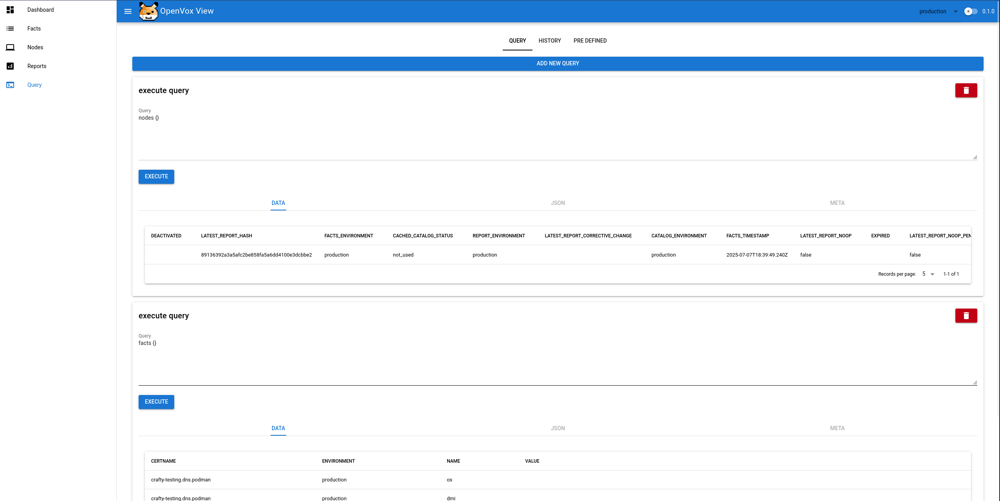
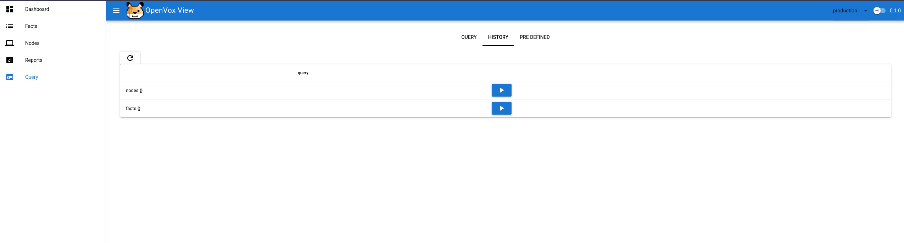

# OpenVox View
[](https://github.com/sebastianrakel/openvoxview/actions/workflows/ci.yml)


## Project Status
This project is currently in its beta stage and may not be suitable for production use.

## Introduction
OpenVox View is a viewer for openvoxdb/puppetdb, inspired by [Puppetboard](https://github.com/voxpupuli/puppetboard).

## Features
- Overview of reports
- Overview of facts
- Overview of nodes
- Predefined views
- Ability to perform multiple queries
- Query history
- Predefined queries

## Container
You can build a container with the Containerfile

```podman build -t openvoxview .```

or for Docker 
```docker build -t openvoxview -f Containerfile```

## Screenshots
### Reports Overview


### Node Detail


### Query Execution


### Query History


## Contribution
We welcome you to create issues or submit pull requests. Be excellent to each other.

## Special Thanks
We extend our gratitude for the remarkable work on [Puppetboard](https://github.com/voxpupuli/puppetboard).
